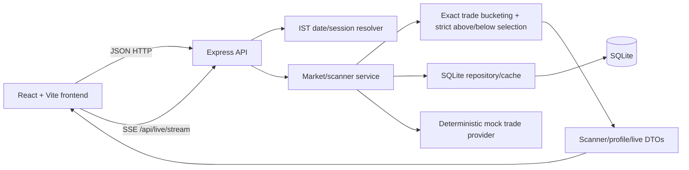

# Architecture and API contract

This document describes the implemented V1 local architecture, not a planned production design. The backend is the source of truth for dates, previous-session opens, exact mock-trade aggregation, strict above/below level selection, filters, sorting, rankings, and live-update envelopes. The frontend is a rendering client and does not recompute these values.

Related operational contracts: [`DATA_PIPELINE.md`](./DATA_PIPELINE.md) describes ingestion, persistence, quality states, and daily workflow; [`PROVIDER_INTEGRATION.md`](./PROVIDER_INTEGRATION.md) documents the honest provider boundary and exact-versus-estimated rules.

## Scope and truth labels

The application is a read-only NSE F&O **prototype**:

- `dataMode: "mock"` is present on successful data responses because all observations are generated locally.
- `calculationMode: "exact"` means quantities are grouped from each supplied trade record, not estimated from candles. It is exact relative to the generated/mock trade set, not evidence of a complete or exchange-certified feed.
- The primary V1 result is `previousOpen` plus up to three highest-volume levels strictly above and strictly below it. A compatibility HVTP field may remain in transport responses, but no single HVTP ranking is the product output.
- The 30 instruments are representative F&O underlyings (24 equities and 6 indices). Their current constituents, F&O eligibility, and lot sizes are not verified against the NSE contract master.
- There is no order, broker, account, portfolio, authentication, authorization, or investment-signal feature.

The prototype intentionally does **not** calculate value area, POC/VAL/VAH, volume-by-price from OHLCV candles, or any other inferred execution distribution. OHLCV cannot reveal where within a candle its volume traded; this application does not pretend otherwise.

## System shape



The root is an npm workspace containing `backend` and `frontend`. `npm run dev` starts the backend on port `3001` and Vite on port `5173`. `Node >=22.12` is the supported runtime. See `.env.example` for optional local configuration.

### Responsibilities

- **Backend:** resolves requested dates in IST; resolves previous sessions; persists/seeds symbols and trades in SQLite; calculates bucketed exact quantities; selects up to three levels strictly above and below the previous open; applies scanner filters and ordering; serves profiles, trades, previous opens, and simulated live updates.
- **Frontend:** requests backend DTOs; displays scanner/dashboard/detail views; renders levels and price series; manages filters and SSE connection/reconnection state. It should not independently calculate `pointGap`, `gapPercent`, HVTP, rankings, or session dates.
- **SQLite:** local persistence and cache/storage for the generated universe, sessions, previous opens, and trades. Profiles are calculated on demand rather than persisted as aggregate records. It is not a distributed data store.
- **Provider boundary:** the mock provider is replaceable, but a real provider adapter is not included. Provider credentials must remain server-side.

## Dates and session semantics

Dates are `YYYY-MM-DD` and are interpreted in India Standard Time. The backend exposes a `defaultDate` on health/scanner responses: the previous trading day relative to the application/session clock. Omitting `date` uses that value.

A requested weekend resolves backward to a preceding weekday. An explicitly configured sample holiday returns `No trading session` rather than inventing data. The holiday calendar is only a small sample (currently a curated 2025–2026 list); it is not a complete NSE holiday calendar. Responses preserve the requested value and expose the resolved selected date, `previousSessionDate`, and `sessionStatus` so a caller can distinguish a direct session from a fallback or a missing/low-liquidity session.

For a selected date `D`:

- the profile's trades and `currentPrice` come from `D`;
- `previousSessionDate` is the immediately preceding resolved trading session;
- `previousDayOpen` is the opening print from `previousSessionDate` (also returned under the compatibility alias `previousOpen`); and
- selected-session levels are calculated from trades on `D`; V1 selects up to three highest-volume levels strictly above and below `previousOpen`.

The mock data generator produces deterministic trades for the supported sessions. Baseline generation with the same symbol/date produces the same trades. Simulated trades are persisted in SQLite and included in later reads, so profiles can change after a live subscription has run. It is a development fixture, not a replay of NSE.

## Calculation semantics

### Inputs

A normalized trade has a symbol, IST-normalized timestamp, selected trade date, positive price, positive integer quantity, and buy/sell side. The mock provider supplies 8,640 baseline trades per symbol/date. There is no OHLCV-to-trade approximation path.

### Paise-safe bucket assignment

The supported `bucket` values are `.05`, `1`, `5`, and `10` rupees. The implementation converts prices to integer paise and rounds each observed trade to the nearest requested bucket boundary:

```text
bucketPaise = requestedBucketRupees × 100
levelPaise = round(pricePaise / bucketPaise) × bucketPaise
levelPrice = levelPaise / 100
```

A midpoint follows JavaScript's `Math.round` behavior. Integer paise avoids floating-point drift; this is nearest-bucket assignment, not floor assignment. The returned `levels` contain aggregated quantity and trade count for every retained price level; a profile response includes **all** levels, while scanner rows carry only the requested `topLevels` subset in `topLevels`.

### Previous-open comparison and level selection

The primary V1 result is bounded volume around the previous session's open. After bucket aggregation, the backend excludes the open itself and splits levels by strict price comparison:

```text
aboveLevels = levels where level.price > previousOpen
belowLevels = levels where level.price < previousOpen
```

Each side is sorted by quantity descending, then distance from `previousOpen` ascending, then price ascending. At most three levels per side are returned to the primary result. This deterministic ordering is independent of database row order and prevents an open-price bucket from being presented as above or below the reference. A complete bucket profile may still be returned for inspection.

Legacy `hvtp`, `hvtpVolume`, and signed/absolute gap fields may be retained for compatibility with older clients. They are not the V1 product ranking. If present, they must be described as compatibility metadata and must never replace the strict above/below level lists in the UI.

The backend returns null/empty values that cannot be calculated (for example, an empty selected session). `status` is a data-availability status: `ok`, `No trade data available`, `Previous open unavailable`, `Low liquidity`, or `No trading session`. `currentPrice` is the last selected-session trade/print, not a live quote.

`liquidityThreshold` is a minimum total selected-session quantity for scanner rows (default `100000`). Any compatibility `minVolume` filter applies only to the legacy HVTP quantity and is not the V1 above/below level contract. Neither threshold turns mock observations into real market data.

## Mock universe and persistence

The seed contains 30 representative symbols (24 equities and 6 indices), sectors, F&O flags, and illustrative lot sizes. For each supported selected date and symbol, the deterministic generator uses a symbol/date-derived seed and emits 8,640 exact baseline trades. The resulting rows are persisted in SQLite, along with stock metadata and trading-session information. Cache/database state is local runtime data and can be deleted and regenerated.

The schema contains four tables:

- `stocks`: symbol, name, exchange, sector, instrument type, illustrative lot size, F&O flag, and a mock reference price;
- `trading_sessions`: date-level previous-session date and availability status;
- `session_opens`: per-symbol selected-date lookup of the previous-session open; and
- `trades`: symbol, selected trade date, timestamp, integer-paise execution price, integer quantity, side, and source (`baseline` or `simulated`).

There is no persisted volume-at-price aggregate table. The calculation service builds profiles from stored trades.

A production adapter would need authoritative symbol and contract metadata, a complete exchange holiday calendar, session boundaries, timezone normalization, authenticated access, throttling, retries, corrections, gap detection, and quality monitoring. None is bundled here.

## HTTP contract

All routes are prefixed with `/api`. Successful responses are JSON except the SSE stream. Errors use an HTTP error status and an `error` field/message; clients should not infer market semantics from a failed request. Unknown symbols return `404`. Query/date/enum validation errors return `400` in the completed backend contract.

All successful data responses identify the source and calculation mode:

```json
{
  "dataMode": "mock",
  "calculationMode": "exact"
}
```

### `GET /api/health`

Readiness and defaults. The response includes `defaultDate` (previous trading day in IST), `dataMode: "mock"`, and `calculationMode: "exact"`; deployments may also expose status/session metadata.

### `GET /api/scanner`

The scanner accepts these query parameters:

| Parameter | Accepted values | Meaning |
| --- | --- | --- |
| `date` | `YYYY-MM-DD`, optional | Requested selected session; defaults to `defaultDate`; weekends resolve backward; sample holidays can have no session |
| `bucket` | `.05`, `1` (default), `5`, `10` | Paise-safe rupee bucket width |
| `topLevels` | `1`, `3` (default), `5`, `10` | Highest-volume levels embedded in each scanner row |
| `sort` | `symbol` (default), `previousOpen`, `currentPrice`, or compatibility fields `pointGap`, `hvtpVolume`, `gapPercent`, `hvtp`, `signedGap`, `currentVsHvtp` | Backend ordering field; V1 does not make HVTP ranking primary |
| `order` | `asc`, `desc` (default `desc`) | Ordering direction |
| `direction` | `all` (default), `above`, `below` | Filters status based on signed gap |
| `minVolume` | non-negative quantity | Minimum `hvtpVolume` |
| `limit` | `10`, `25`, `50`, `all` (default) | Result size |
| `sector` | sector name | Exact sector filter |
| `query` | text | Symbol/name search |
| `liquidityThreshold` | `100000` by default | Minimum total selected-session quantity for scanner rows |

The response envelope is:

```json
{
  "rows": [
    {
      "symbol": "RELIANCE",
      "name": "Reliance Industries",
      "sector": "Energy",
      "previousDayOpen": 1250,
      "previousOpen": 1250,
      "hvtp": 1275,
      "hvtpVolume": 182000,
      "signedGap": 25,
      "pointGap": 25,
      "gapPercent": 2,
      "currentPrice": 1281.4,
      "currentVsHvtp": 6.4,
      "status": "ok",
      "topLevels": [],
      "dataMode": "mock",
      "calculationMode": "exact"
    }
  ],
  "count": 1,
  "date": "2025-01-15",
  "requestedDate": "2025-01-15",
  "previousSessionDate": "2025-01-14",
  "defaultDate": "2025-01-15",
  "sessionStatus": "ok",
  "dataMode": "mock",
  "calculationMode": "exact",
  "overview": {
    "scanned": 30,
    "above": 12,
    "below": 11,
    "unchanged": 1,
    "largestGap": 125.5,
    "smallestGap": 0,
    "averageGap": 42.75
  },
  "rankings": {
    "largestGaps": [],
    "highestVolume": [],
    "closestToOpen": []
  }
}
```

This is an illustrative, shortened JSON example, not a captured market response. V1 rows additionally expose strict `aboveLevels` and `belowLevels` lists (up to three per side), selected by quantity around the previous open; compatibility HVTP/gap fields in this example are retained only for older clients. Overview/rankings cover the whole selected-session universe before row filters/limits. `rows` are already filtered and ordered; the frontend must not apply a conflicting second sort.

### `GET /api/stocks` and `GET /api/instruments`

Returns the mock universe, including symbol, display name, exchange, sector, instrument type, representative `lotSize`, and `isFno`. This metadata is not a verified current NSE contract master.

### `GET /api/stocks/:symbol`

Returns stock metadata plus the selected-date profile/summary for that symbol. Optional `date`, `bucket`, and `topLevels` query parameters use the same session and bucket semantics as the profile route.

### `GET /api/trades/:symbol`

Returns normalized exact mock trades for a symbol/date. Optional `limit` (positive integer) and `offset` (non-negative integer) parameters paginate the records; omitting `limit` returns all remaining trades. Trades are source observations, not quotes or orders, and carry the `dataMode`/`calculationMode` labels.

### `GET /api/market/previous-open/:symbol`

Returns the previous-session open used for the selected symbol/date comparison, along with the resolved date/session context. It is not the selected session's open unless the selected/previous dates happen to be the same (which the resolver should avoid).

### `GET /api/volume-profile/:symbol`

Returns a symbol's selected-date profile. V1 consumers use `previousOpen`/`previousDayOpen`, `aboveLevels`, and `belowLevels` (at most three levels per side, strictly excluding the open), plus `levels` when the complete profile is requested. Compatibility clients may also receive `topLevels`, `hvtp`, `hvtpVolume`, `hvtpLevels`, gap fields, `currentPrice`, `currentVsHvtp`, `priceSeries`, `previousSessionDate`, `name`, and `sector`, plus source/calculation labels. Compatibility fields must not replace the V1 above/below result.

A conceptual profile fragment is:

```json
{
  "symbol": "RELIANCE",
  "date": "2025-01-15",
  "previousSessionDate": "2025-01-14",
  "previousDayOpen": 1250,
  "previousOpen": 1250,
  "hvtp": 1275,
  "hvtpVolume": 182000,
  "signedGap": 25,
  "pointGap": 25,
  "gapPercent": 2,
  "currentPrice": 1281.4,
  "currentVsHvtp": 6.4,
  "levels": [],
  "topLevels": [],
  "priceSeries": [],
  "dataMode": "mock",
  "calculationMode": "exact"
}
```

### `GET /api/analysis/:symbol`, `GET /api/levels`, and `GET /api/levels/:symbol`

These read-only aliases expose a profile or scanner directional rows for integrations that use analysis/levels terminology. They retain the same previous-session and source/calculation metadata as the primary routes.

### `GET /api/sessions`, `GET /api/sessions/:date`, `GET /api/monitor`, and `GET /api/collection/status`

These endpoints expose resolved session context and collection coverage: expected/received instruments, missing symbols, trade counts, latest received timestamp, connection status, error count, and recent collection runs. They do not imply that a mock provider is connected to an exchange.

### `GET /api/history`, `GET /api/export/levels.json`, and `GET /api/export/levels.csv`

History returns persisted analysis profiles. Export routes flatten backend-selected above/below levels with rank, volume, trade count, signed/point/percentage gaps, and data-quality state. Export is descriptive and read-only.

### `POST /api/jobs/collect`, `POST /api/jobs/analyze`, and `POST /api/jobs/reprocess`

These are local synchronous operational actions returning `202`; they are not a durable queue or scheduler and should not be exposed without authentication.

### `GET /api/live`

A finite polling endpoint accepting scanner query parameters plus an optional `symbol`. When no SSE clients are connected for the resolved date, polling advances its simulation at most once every two seconds. Active SSE clients own the shared clock; polling reads their current snapshot without adding extra trades. The response includes `simulated: true`, the current `sequence`, and an optional profile/latest trade. It is not a market-data quote.

### `GET /api/live/stream`

A continuous `text/event-stream` endpoint accepting scanner query parameters plus an optional `symbol`. It sends an initial snapshot and then emits an `update` event every two seconds. Scanner filters and ordering are preserved in stream updates. Each event contains the scanner envelope, `simulated: true`, and a monotonic `sequence`; when a symbol/profile is requested, the update may also include a `profile` object. The stream is an in-process simulation over deterministic local data: it is not a connection to NSE and does not guarantee delivery or replay. Synthetic trades are persisted in SQLite, and their timestamps extend beyond the baseline session close; this is not an exchange-session replay.

Example framing:

```text
event: update
data: {"sequence":7,"simulated":true,"rows":[],"count":0,"dataMode":"mock","calculationMode":"exact"}

```

The frontend uses EventSource automatic reconnection and displays disconnection errors. It does not implement polling fallback. Other clients can poll `GET /api/live` for finite simulation steps without maintaining an SSE connection. Sequence state survives disconnects within a server process, but is not durable across process restarts.

## Configuration

Root `.env.example` documents these optional values:

| Variable | Default | Used by |
| --- | --- | --- |
| `PORT` | `3001` | Backend listen port |
| `HOST` | `127.0.0.1` | Backend listen host |
| `FRONTEND_PORT` | `5173` | Vite development-server port |
| `DB_PATH` | `./data/scanner.sqlite` | SQLite path, relative to `backend/` unless absolute; `DATABASE_PATH` is accepted as a compatibility alias and takes precedence if explicitly set |
| `CORS_ORIGIN` | `http://localhost:5173` | Browser origin policy; not authentication |
| `VITE_API_URL` | `/api` | Frontend API base URL; public/browser-visible |
| `MARKET_DATA_MODE` | `mock` | `mock` is supported; `real` fails fast in the current synchronous HTTP path rather than silently falling back |
| `MARKET_DATA_URL` | unset | Reserved server-side endpoint for the real-provider scaffold/async ingestion workflow |
| `MARKET_DATA_API_KEY` | unset | Reserved server-side credential for an injected real provider; never expose through Vite |

Both workspaces load the repository-root `.env`; exported environment variables take precedence. The backend also reads `backend/.env` for values not already set. Vite's `/api` development proxy follows the backend `HOST` and `PORT`. `VITE_*` variables are compiled into frontend assets, so they must contain only non-secret routing/configuration values. Do not add an NSE key to `.env` and then expose it through `VITE_*`.

## Testing and verification

Run from the repository root:

```bash
npm test
npm run typecheck
npm run build
```

Backend-focused commands are:

```bash
npm run typecheck --workspace backend
npm test --workspace backend
npm run build --workspace backend
```

Frontend-focused commands are:

```bash
npm test --workspace frontend
npm run typecheck --workspace frontend
npm run build --workspace frontend
```

Useful local smoke checks while `npm run dev` is running:

```bash
curl http://localhost:3001/api/health
curl 'http://localhost:3001/api/scanner?bucket=5&topLevels=3&sort=pointGap&order=desc&limit=10'
curl 'http://localhost:3001/api/volume-profile/RELIANCE?bucket=5&topLevels=5'
curl 'http://localhost:3001/api/market/previous-open/RELIANCE'
```

Tests should preserve the contract's important invariants: deterministic symbol/date generation; exact quantity totals; integer-paise nearest buckets; strict exclusion of the previous-open level; deterministic quantity/distance/price ordering with at most three levels per side; date fallback and previous-session lookup; response envelopes; low-liquidity/empty sessions; and simulated SSE cadence/sequence. Compatibility fields may be tested separately, but must not displace the V1 above/below result. None of these tests establishes that the synthetic prices resemble NSE.

## Replacing the mock provider

A future provider should be isolated behind the backend's market-data boundary and should return normalized execution-level trades if `calculationMode` remains `exact`. It must:

1. use an authoritative NSE instrument/contract master and complete holiday/session calendar;
2. normalize timestamps and session dates in IST;
3. preserve source corrections, duplicate/late packets, and missing-data status;
4. provide authenticated, rate-limited, retried, monitored access without exposing credentials to the frontend;
5. validate previous-session opens and exact trade quantities against an authoritative source; and
6. keep `dataMode` and `calculationMode` truthful if it cannot supply complete execution-level data.

If only OHLCV is available, the backend must introduce and document a separate approximation mode. It must not label candle-derived allocation as `exact`.

## Daily operation, deployment, and security

For the supported local workflow, run `npm install`, then `npm run dev`, check `/api/health`, select a date, verify the resolved session/previous open and visible `MOCK`/`exact` labels, inspect above/below levels, and use simulated live only to exercise SSE. Do not interpret the simulated stream as exchange data. The full workflow and reset procedure are in [`DATA_PIPELINE.md`](./DATA_PIPELINE.md).

For a single-instance deployment, run `npm run build`, start the compiled backend with `npm start --workspace backend`, serve `frontend/dist/` separately, and proxy `/api` plus `/api/live/stream` to the backend. Keep SQLite on a persistent, access-controlled volume and disable reverse-proxy buffering for SSE. The in-process live clock and SQLite file are not horizontal-scale infrastructure; use shared durable services before adding multiple backend instances.

The current server binds to `127.0.0.1` by default and has no authentication or authorization. Before exposing it beyond a trusted machine, put it behind an authenticated TLS gateway with restrictive CORS, request limits, audit logging, secret rotation, and protected database backups. CORS is not authentication. Never put provider secrets in `VITE_*` variables or browser requests. Provider limitations and the exact/estimated acceptance rules are in [`PROVIDER_INTEGRATION.md`](./PROVIDER_INTEGRATION.md).

## Known limitations and disclaimer

- All data is deterministic mock data; `exact` describes grouping of that mock trade set only.
- The 30-instrument universe, F&O status, lot sizes, prices, and trades are not verified market data.
- Weekend handling is implemented; the holiday calendar is a sample and incomplete.
- Missing/low-liquidity sessions may produce partial or empty profiles and status metadata.
- There is no value-area/POC calculation, no OHLCV approximation, no real-time exchange feed, and no execution/trading integration.
- SQLite and the in-process SSE simulation are local-MVP choices, not horizontal-scale or guaranteed-delivery infrastructure.
- The primary result is previous open plus strict above/below levels; compatibility HVTP fields do not establish a market signal.
- Results are descriptive analytics and must not be used to place trades or make investment decisions.
